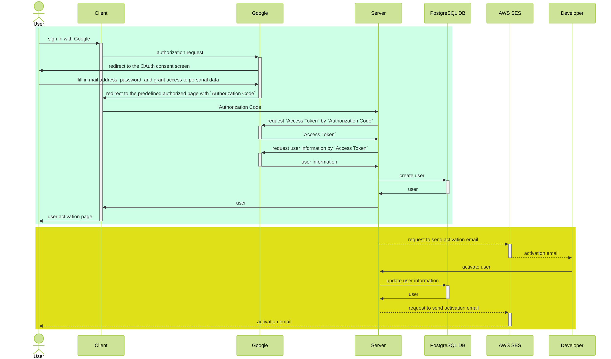

# Sign Up

```mermaid
%%{init: { 'theme':'forest', 'sequence': {'useMaxWidth':false} } }%%
sequenceDiagram
    actor user as User
    participant client as Client
    participant google as Google
    participant server as Server
    participant pdb as PostgreSQL DB
    participant ses as AWS SES
    participant rd as Developer

    rect rgb(204, 255, 229)
    user ->>+ client: sign in with Google
    client ->>+ google: authorization request
    google ->> user: redirect to the OAuth consent screen
    user ->> google: fill in mail address, password, and grant access to personal data
    google ->>- client: redirect to the predefined authorized page with `Authorization Code`
    client ->> server: `Authorization Code`
    server ->>+ google: request `Access Token` by `Authorization Code`
    google ->>- server: `Access Token`
    server ->>+ google: request user information by `Access Token`
    google ->>- server: user information
    server ->>+ pdb: create user
    pdb ->>- server: user
    server ->> client: user
    client ->>- user: user activation page
    end
    rect rgb(224, 224, 24)
    server -->>+ ses: request to send activation email
    ses -->>- rd: activation email
    rd ->>+ server: activate user
    server ->>+ pdb: update user information
    pdb ->>- server: user
    server -->>+ ses: request to send activation email
    ses -->>- user: activation email
    end
```
